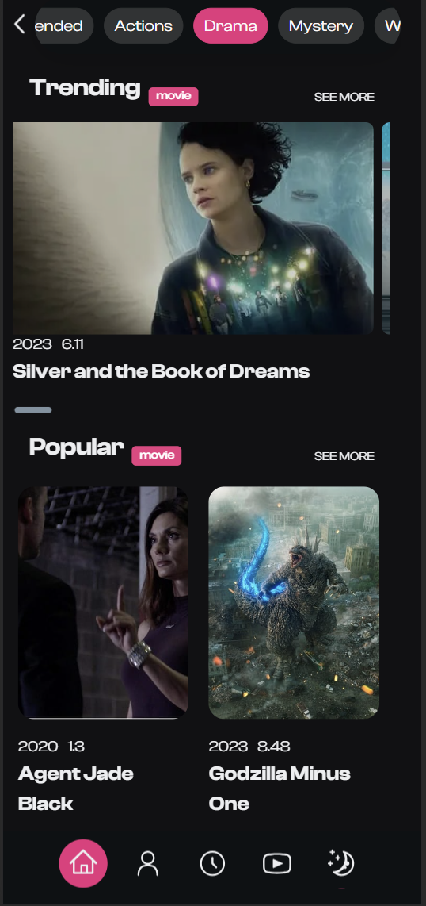
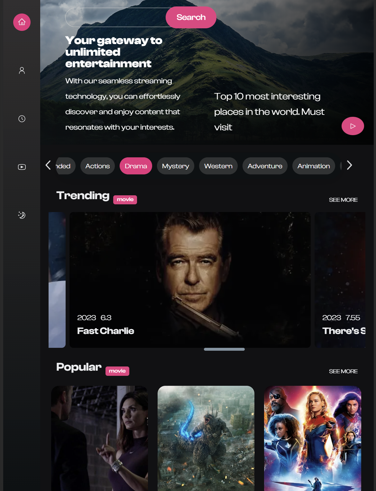

## Movie Entertainment App
This is a simple movie entertainment app that displays a list of movies and their trailers. The app is written in Next.js to serve the web pages. The app uses the [The Movie Database API](https://www.themoviedb.org/documentation/api) to get the movie data.

## Sceeenshots

## Purpose
The purpose of this project is to demonstrate the use of Next.js and have a functional web app. Secondly, I want to demonstrate my ability to learn new technologies and apply them to a project.

## Stack
- Next.js
- Flexbox
- Mobile first design
- Tailwind CSS

The reasons for choosing Next.js are:
- Next.js is a React-based web development framework that allow developers to easily build fully-fledged websites.
- It offers the ability to choose different page rendering methods for each page.
- Support TypeScript out of the box.
- Adopted by various companies such as Netflix, Twitch, and Uber.

## Lesson learned:
1. At first, I was using the Tailwind CSS, but I found it difficult to maintain and use them.Then, I decided to use traditional css instead. Use whatever suits you!
2. Use mobile-first design, it makes it easier to scale up to larger screens, design your css mobile first, then scale up to larger screens with media query.
3. Implement a horizontal tab navigation bar and horizontal scrollable content:
    - Use `overflow-x: scroll` to make the content scrollable.
    - set the container as overflow-x: auto; white-space: nowrap; to make the content scrollable horizontally.
    - set the child element as display: inline-block; to make the child element display in a row.
    - Implement the scroll function using useRef to reference the tab menu element, then change the scrollLeft property to scroll the content.
    - [How to implement the scrollable horizontal menu](https://www.youtube.com/watch?v=as01ehtBN0Y&t=1227s&ab_channel=CodingSnow)
## Problems encountered:
